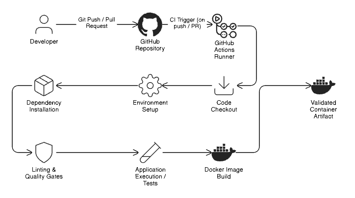

# Architecture

This document describes the logical architecture of the Continuous Integration (CI) system implemented in this project. The architecture focuses on the flow of code changes through the CI pipeline and the interactions between components.

## CI Architecture

The CI architecture follows a straightforward, event-driven model:

This flow ensures that every code change is automatically validated in a controlled environment.

## Architectural Components

### Developer Environment
Developers work locally using their preferred tools and push code changes to the GitHub repository. Local environment differences do not affect CI outcomes.

### GitHub Repository
The repository acts as the single source of truth and contains:
- Application source code
- CI workflow definitions
- Configuration files
- Documentation

All CI activity is triggered by events originating from this repository.

### GitHub Actions
GitHub Actions serves as the CI orchestration layer. It listens for repository events and executes workflows accordingly.

Key responsibilities include:
- Provisioning CI runners
- Executing workflow steps
- Capturing logs and results
- Enforcing pipeline ordering

### CI Runner Environment
The pipeline runs on GitHub-hosted Linux runners, which provide:
- A clean execution environment for each run
- Pre-installed Docker and system tools
- Isolation between pipeline executions

Each workflow run is independent and stateless.

### Quality Gate Layer
Static code analysis is performed early in the pipeline using linting tools. This layer acts as a gatekeeper:

- Prevents invalid code from progressing
- Stops pipeline execution on failure
- Blocks artifact generation when quality standards are not met

### Artifact Generation
Once all validation steps pass, the pipeline builds a Docker image. This image represents a validated artifact that can be safely used in downstream CD or deployment workflows.

## Design Characteristics

The CI architecture is intentionally designed to be:

- **Linear:** Steps execute in a clear and predictable order
- **Deterministic:** Same inputs produce the same outcomes
- **Fail-fast:** Errors halt the pipeline early
- **Environment-agnostic:** CI does not depend on local setups

## Scope Boundaries

This architecture is limited to Continuous Integration only. It does not include:
- Image registry storage
- Deployment targets
- Runtime infrastructure
- Monitoring or alerting systems

These components are intentionally excluded and reserved for future projects.

## Summary

The CI architecture implemented in this project provides a clean, reliable path from code change to validated artifact. By centralizing validation and build logic within GitHub Actions, the system ensures consistency, visibility, and quality across all pipeline executions.

---
