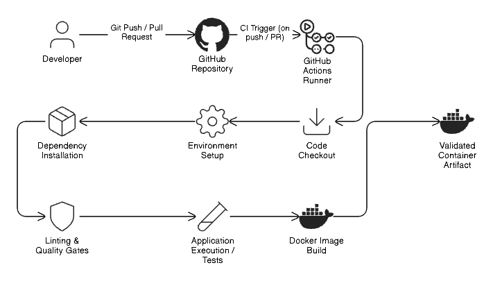

# 🏛️ Architecture

---

## 🗺️ Logical Architecture

This document describes the logical architecture of the **Continuous Integration (CI)** system. The architecture focuses on the flow of code changes through the CI pipeline and the interactions between discrete components.

### High-Level Flow
The CI architecture follows a straightforward, **event-driven model**:

> [!NOTE]
> This flow ensures that every code change is automatically validated in a controlled environment.

---

## 🧩 Architectural Components

### 1. Developer Environment
Developers work locally using their preferred tools and push code changes to the GitHub repository.
*   *Key Characteristic*: Local environment differences do not affect CI outcomes.

### 2. GitHub Repository
The repository acts as the **single source of truth**, containing:
*   Application source code.
*   CI workflow definitions.
*   Configuration files.

### 3. GitHub Actions (Orchestrator)
GitHub Actions serves as the CI orchestration layer. It listens for repository events and executes workflows.
*   **Responsibilities**:
    *   Provisioning CI runners.
    *   Executing workflow steps.
    *   Enforcing pipeline ordering.

### 4. CI Runner Environment
The pipeline runs on GitHub-hosted Linux runners.
*   **Characteristics**:
    *   Clean execution environment for each run.
    *   Isolation between pipeline executions.
    *   Stateless workflow runs.

### 5. Quality Gate Layer
Static code analysis acts as a **gatekeeper**:
*   Prevents invalid code from progressing.
*   Stops pipeline execution immediately on failure.

### 6. Artifact Generation
Once all validation steps pass, the pipeline builds a **Docker image**. This image represents a validated artifact ready for downstream use.

---

## 💎 Design Characteristics

The CI architecture is intentionally designed to be:

| Characteristic | Description |
| :--- | :--- |
| **Linear** | Steps execute in a clear, predictable order. |
| **Deterministic** | Same inputs produce the same outcomes. |
| **Fail-Fast** | Errors halt the pipeline early. |
| **Agnostic** | CI does not depend on local setups. |

---

## 🚧 Scope Boundaries

This architecture is limited to **Continuous Integration only**.

**Excluded Contexts:**
*   ❌ Image registry storage
*   ❌ Deployment targets
*   ❌ Runtime infrastructure
*   ❌ Monitoring systems

*These components are intentionally reserved for future projects.*

---

## 📝 Summary

The CI architecture implemented in this project provides a clean, reliable path from code change to validated artifact. By centralizing validation and build logic within GitHub Actions, the system ensures **consistency, visibility, and quality** across all pipeline executions.

---

**[⏪ Previous: Technology Stack](./05_tech_stack.md) | [Next: CI Workflow Breakdown ➤](./07_ci_workflow_breakdown.md)**

