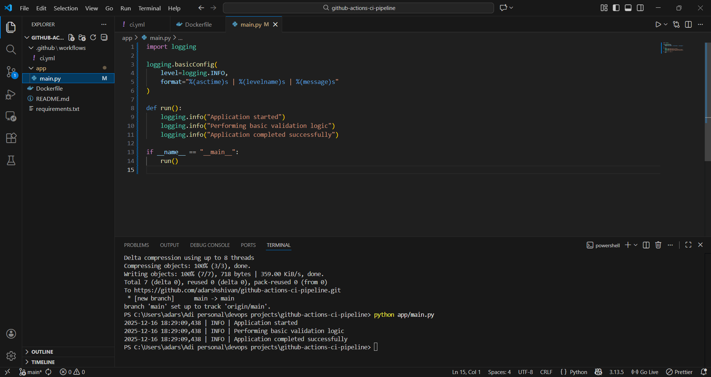
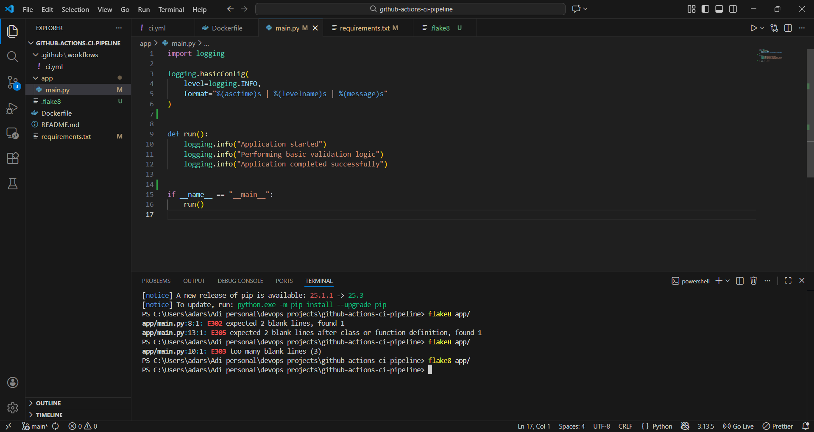
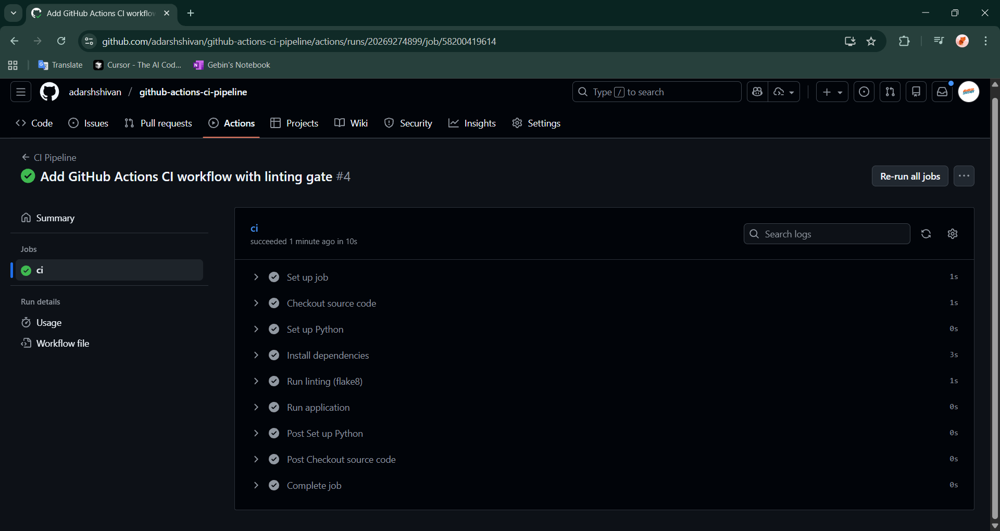
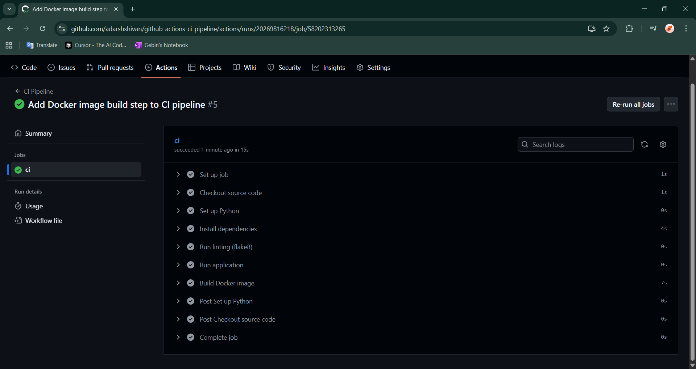
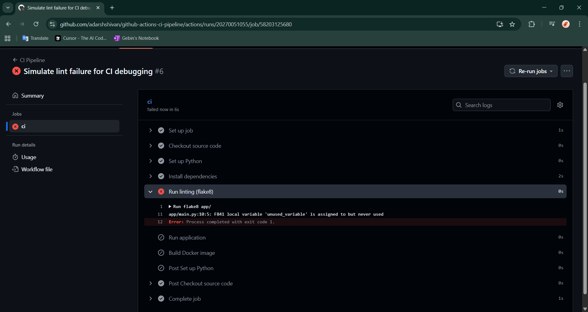
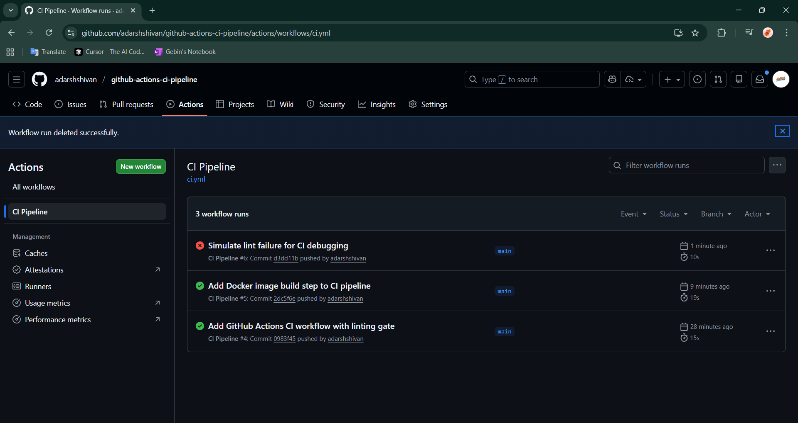
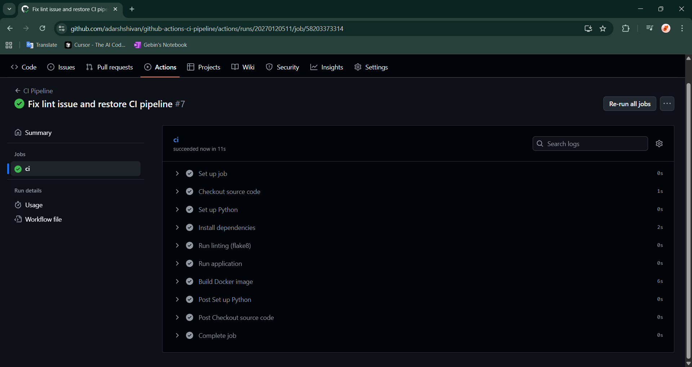
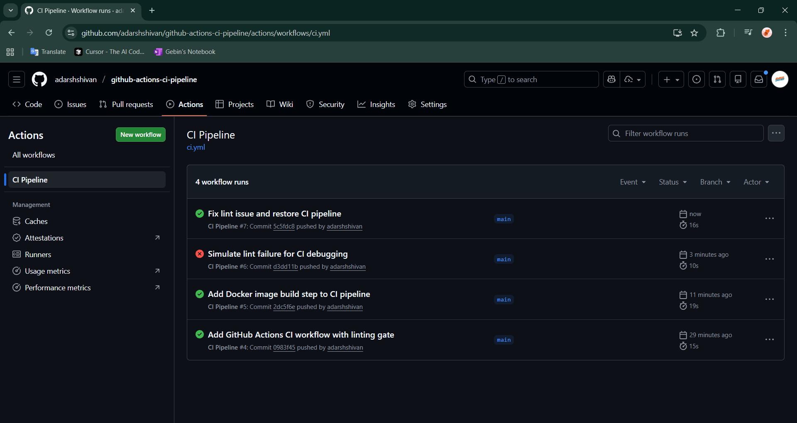

# Screenshots

**01-app-local-run**

**02-flake8-local-run**

**03-github-workflow-steps**

**04-docker-image-added**

**05-failure-simulation**

**06-failure-workflow**

**07-fix-failure**

**08-after-fix-workflow**

---