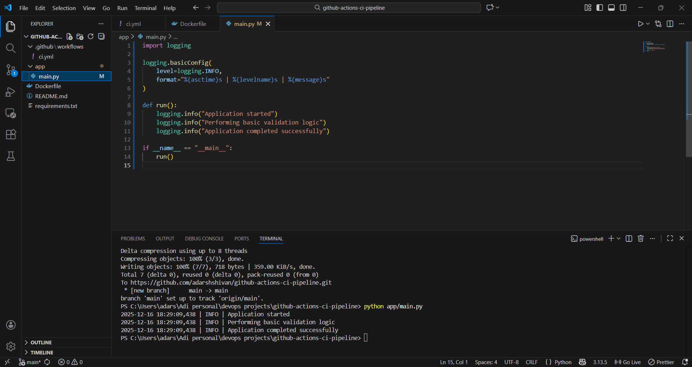
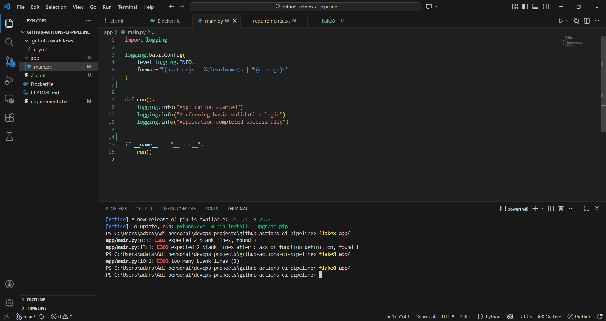
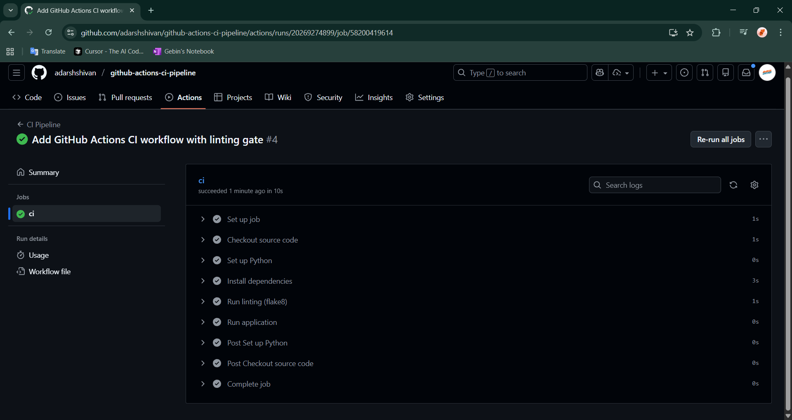
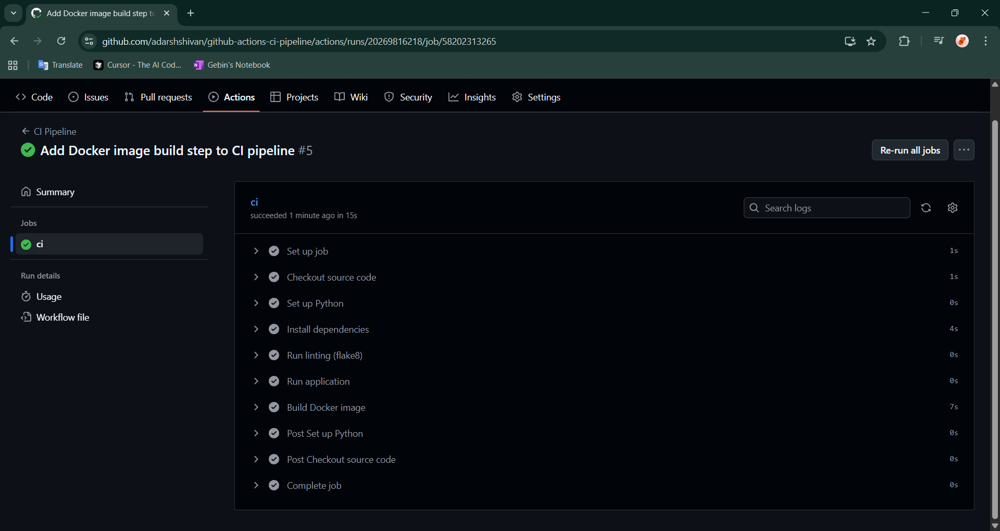
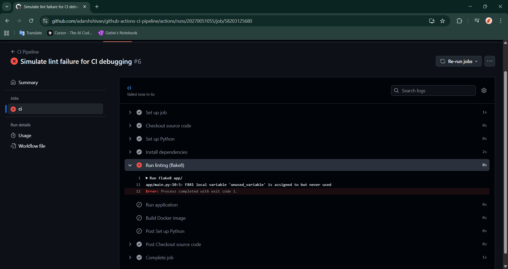
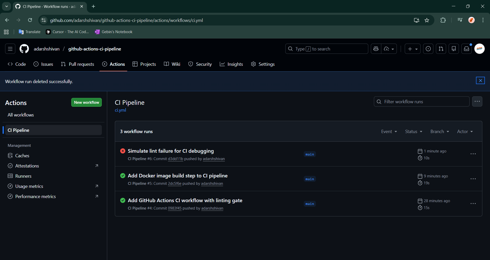
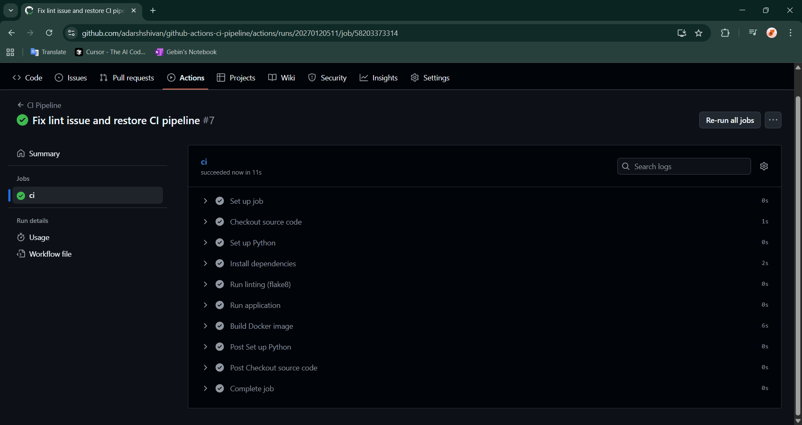
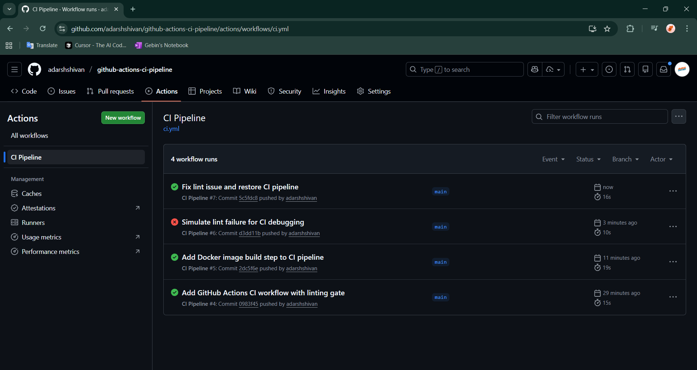

# 📸 Screenshots

---

## 🖼️ Project Gallery

This section contains visual evidence of the pipeline's execution, failure simulation, and recovery.

| Description | Screenshot |
| :--- | :--- |
| **1. Local App Run** |  |
| **2. Local Flake8 Run** |  |
| **3. Workflow Steps** |  |
| **4. Docker Image Build** |  |
| **5. Failure Simulation** |  |
| **6. Failure Workflow** |  |
| **7. Fix Application** |  |
| **8. Recovery Workflow** |  |

---

**[⏪ Previous: Future Enhancements](./11_future_enhancements.md) | [🏠 Return to Project Overview](./01_project_overview.md)**

